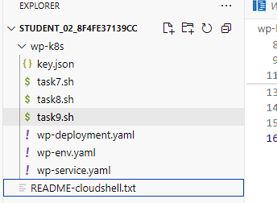

## Multiple VPC NetWork

[Set up and Configure a Cloud Environment in Google Cloud - Multiple VPC Networks | Google Cloud Skills Boost](https://www.cloudskillsboost.google/course_templates/625/labs/566601)

### **Create the privatenet network**

```shell
# create privatenet 
gcloud compute networks create privatenet --subnet-mode=custom

# create privatesubnet-1
gcloud compute networks subnets create privatesubnet-1 --network=privatenet --region=us-west1 --range=172.16.0.0/24

# create privatesubnet-2
gcloud compute networks subnets create privatesubnet-2 --network=privatenet --region=europe-west4 --range=172.20.0.0/20

# list the available VPC subnets (sorted by VPC network):
gcloud compute networks subnets list --sort-by=NETWORK
```

### Create the firewall rules

```shell
gcloud compute firewall-rules create privatenet-allow-icmp-ssh-rdp --direction=INGRESS --priority=1000 --network=privatenet --action=ALLOW --rules=icmp,tcp:22,tcp:3389 --source-ranges=0.0.0.0/0
```

### Create VM with privatenet network

```shell
gcloud compute instances create privatenet-vm-1 --zone=us-west1-a --machine-type=e2-micro --subnet=privatesubnet-1

```

### Explore the connetivity between VM instance

```shell
# check the connetivity from vm1 to vm2
ping -c 3 'ip address'
```

### Create vm with multiple network

```shell
gcloud compute instances create vm-appliance \
    --project=qwiklabs-gcp-00-21e3843e2c99 \
    --zone=us-west1-a \
    --machine-type=e2-standard-4 \
    --network-interface=network-tier=PREMIUM,stack-type=IPV4_ONLY,subnet=privatesubnet-1 \
    --network-interface=network-tier=PREMIUM,stack-type=IPV4_ONLY,subnet=managementsubnet-1 \
    --network-interface=network-tier=PREMIUM,stack-type=IPV4_ONLY,subnet=mynetwork \
    --metadata=enable-osconfig=TRUE,enable-oslogin=true \
    --maintenance-policy=MIGRATE \
    --provisioning-model=STANDARD \
    --service-account=709601049229-compute@developer.gserviceaccount.com \
    --scopes=https://www.googleapis.com/auth/devstorage.read_only,https://www.googleapis.com/auth/logging.write,https://www.googleapis.com/auth/monitoring.write,https://www.googleapis.com/auth/service.management.readonly,https://www.googleapis.com/auth/servicecontrol,https://www.googleapis.com/auth/trace.append \
    --create-disk=auto-delete=yes,boot=yes,device-name=vm-appliance,disk-resource-policy=projects/qwiklabs-gcp-00-21e3843e2c99/regions/us-west1/resourcePolicies/default-schedule-1,image=projects/debian-cloud/global/images/debian-12-bookworm-v20250709,mode=rw,size=10,type=pd-balanced \
    --no-shielded-secure-boot \
    --shielded-vtpm \
    --shielded-integrity-monitoring \
    --labels=goog-ops-agent-policy=v2-x86-template-1-4-0,goog-ec-src=vm_add-gcloud \
    --reservation-affinity=any \
&& \
printf 'agentsRule:\n  packageState: installed\n  version: latest\ninstanceFilter:\n  inclusionLabels:\n  - labels:\n      goog-ops-agent-policy: v2-x86-template-1-4-0\n' > config.yaml \
&& \
gcloud compute instances ops-agents policies create goog-ops-agent-v2-x86-template-1-4-0-us-west1-a \
    --project=qwiklabs-gcp-00-21e3843e2c99 \
    --zone=us-west1-a \
    --file=config.yaml
```

## Cloud Monitoring

### Create a Monitoring Metrics Scope

Install the monitoring and logging agents

Run the Monitoring agent install script command in the SSH terminal of your VM instance to install the Cloud Monitoring agent:

```shell
curl -sSO https://dl.google.com/cloudagents/add-google-cloud-ops-agent-repo.sh

sudo bash add-google-cloud-ops-agent-repo.sh --also-install

```

## Develop your Google Cloud Network: Challenge Lab

https://www.cloudskillsboost.google/course_templates/625/labs/566604

```shell
gcloud config set compute/region us-east1
gcloud config set compute/zone us-east1-c
```

### Task1 Create Development VPC

```shell
gcloud compute networks create griffin-dev-vpc --subnet-mode custom

gcloud compute networks subnets create griffin-dev-wp --network=griffin-dev-vpc --range=192.168.16.0/20

gcloud compute networks subnets create griffin-dev-mgmt --network=griffin-dev-vpc --range=192.168.32.0/20
```

### Task2 Create production VPC

```shell
gcloud compute networks create griffin-prod-vpc --subnet-mode custom

gcloud compute networks subnets create griffin-prod-wp --network=griffin-prod-vpc --range=192.168.48.0/20

gcloud compute networks subnets create griffin-prod-mgmt --network=griffin-prod-vpc --range=192.168.64.0/20
```

### Task3 Create bastion host

```shell
gcloud compute instances create bastion --network-interface=network=griffin-dev-vpc,subnet=griffin-dev-mgmt  --network-interface=network=griffin-prod-vpc,subnet=griffin-prod-mgmt --tags=ssh

gcloud compute firewall-rules create fw-ssh-dev --source-ranges=0.0.0.0/0 --target-tags ssh --allow=tcp:22 --network=griffin-dev-vpc

gcloud compute firewall-rules create fw-ssh-prod --source-ranges=0.0.0.0/0 --target-tags ssh --allow=tcp:22 --network=griffin-prod-vpc
```

### Task4 Create and configure Cloud SQL Instance

```shell
# create db instance
gcloud sql instances create griffin-dev-db \
    --database-version=MYSQL_5_7 \
    --region=us-east1 \
    --root-password='quicklab'

# create database
gcloud sql databases create wordpress --instance=griffin-dev-db

# create users
gcloud sql users create wp_user --instance=griffin-dev-db --password=stormwind_rules --instance=griffin-dev-db
gcloud sql users set-password wp_user --instance=griffin-dev-db --password=stormwind_rules --instance=griffin-dev-db
gcloud sql users list --instance=griffin-dev-db --format="value(name)" --filter="host='%'" --instance=griffin-dev-db
```

### Task5 Create Kubernetes cluster

```shell
gcloud container clusters create griffin-dev \
  --network griffin-dev-vpc \
  --subnetwork griffin-dev-wp \
  --machine-type e2-standard-4 \
  --num-nodes 2  \
  --zone us-east1-c
```

### Task6 Prepare the Kubernetes cluster

```shell
gcloud container clusters get-credentials griffin-dev --zone us-east1-c

cd ~/

gsutil cp -r gs://cloud-training/gsp321/wp-k8s .

# wp-env file
cat > wp-k8s/wp-env.yaml <<EOF_END
kind: PersistentVolumeClaim
apiVersion: v1
metadata:
  name: wordpress-volumeclaim
spec:
  accessModes:
    - ReadWriteOnce
  resources:
    requests:
      storage: 200Gi
---
apiVersion: v1
kind: Secret
metadata:
  name: database
type: Opaque
stringData:
  username: wp_user
  password: stormwind_rules

EOF_END

cd wp-k8s

kubectl create -f wp-env.yaml

gcloud iam service-accounts keys create key.json \
    --iam-account=cloud-sql-proxy@$GOOGLE_CLOUD_PROJECT.iam.gserviceaccount.com
kubectl create secret generic cloudsql-instance-credentials \
    --from-file key.json
```


---

The last 3 tasks



### Task7 Create a Wordpress development

```shell
INSTANCE_ID=$(gcloud sql instances describe griffin-dev-db --format='value(connectionName)')

cat > wp-deployment.yaml <<EOF_END
apiVersion: apps/v1
kind: Deployment
metadata:
  name: wordpress
  labels:
    app: wordpress
spec:
  replicas: 1
  selector:
    matchLabels:
      app: wordpress
  template:
    metadata:
      labels:
        app: wordpress
    spec:
      containers:
        - image: wordpress
          name: wordpress
          env:
          - name: WORDPRESS_DB_HOST
            value: 127.0.0.1:3306
          - name: WORDPRESS_DB_USER
            valueFrom:
              secretKeyRef:
                name: database
                key: username
          - name: WORDPRESS_DB_PASSWORD
            valueFrom:
              secretKeyRef:
                name: database
                key: password
          ports:
            - containerPort: 80
              name: wordpress
          volumeMounts:
            - name: wordpress-persistent-storage
              mountPath: /var/www/html
        - name: cloudsql-proxy
          image: gcr.io/cloudsql-docker/gce-proxy:1.33.2
          command: ["/cloud_sql_proxy",
                    "-instances=$INSTANCE_ID=tcp:3306",
                    "-credential_file=/secrets/cloudsql/key.json"]
          securityContext:
            runAsUser: 2  # non-root user
            allowPrivilegeEscalation: false
          volumeMounts:
            - name: cloudsql-instance-credentials
              mountPath: /secrets/cloudsql
              readOnly: true
      volumes:
        - name: wordpress-persistent-storage
          persistentVolumeClaim:
            claimName: wordpress-volumeclaim
        - name: cloudsql-instance-credentials
          secret:
            secretName: cloudsql-instance-credentials

EOF_END

kubectl create -f wp-deployment.yaml
kubectl create -f wp-service.yaml
```

### Task8 Monitoring

```shell
#!/bin/bash

# Function to get external IP address of WordPress service
get_external_ip() {
    kubectl get service wordpress -o jsonpath='{.status.loadBalancer.ingress[0].ip}'
}

# Wait for external IP address to become available
wait_for_external_ip() {
    echo "Waiting for external IP address..."
    local external_ip
    for _ in {1..10}; do
        external_ip=$(get_external_ip)
        if [ -n "$external_ip" ]; then
            echo "External IP address found: $external_ip"
            WORDPRESS_EXTERNAL_IP="$external_ip"
            return 0
        fi
        sleep 20
    done
    echo "Timeout: External IP address not found."
    return 1
}

# Main script
if wait_for_external_ip; then
    # External IP address is available, continue with next command
    echo "Executing next command..."
    # Replace the following command with your desired action
    echo "Do something with $WORDPRESS_EXTERNAL_IP"
else
    echo "Exiting script."
    exit 1
fi

# create uptime check
gcloud monitoring uptime create quicklab \
    --resource-type=uptime-url \
    --resource-labels=host=$WORDPRESS_EXTERNAL_IP
```

### Task9 Provide access for an additional engineer

```shell
# Get the IAM policy JSON
IAM_POLICY_JSON=$(gcloud projects get-iam-policy $DEVSHELL_PROJECT_ID --format=json)

# Extract user emails with 'roles/viewer' role
USERS=$(echo $IAM_POLICY_JSON | jq -r '.bindings[] | select(.role == "roles/viewer").members[]')

# Grant 'roles/editor' role to extracted users
for USER in $USERS; do
  if [[ $USER == *"user:"* ]]; then
    USER_EMAIL=$(echo $USER | cut -d':' -f2)
    gcloud projects add-iam-policy-binding $DEVSHELL_PROJECT_ID \
      --member=user:$USER_EMAIL \
      --role=roles/editor
  fi
done
```
